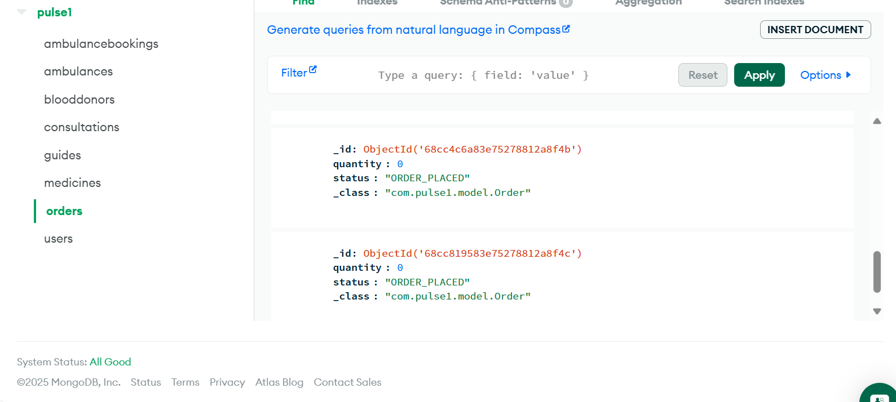

# Pulse1

Pulse1 is a modern healthcare delivery platform designed to connect patients, hospitals, and logistics partners in real-time, ensuring timely delivery of healthcare essentials. Inspired by fast-delivery apps like Zepto and Blinkit, Pulse1 leverages cloud hosting, scalable backend services, and APIs to provide efficient and reliable service.

Key highlights:
- **Real-time matching:** Patients can quickly connect with available healthcare delivery partners.
- **Scalable system:** Designed to handle high traffic and future growth.
- **Seamless integration:** Works with existing logistics partners to streamline operations.
- **Modern tech stack:** React.js frontend, Spring Boot backend, MongoDB + SQL database, and deployment on Render.
- **User-friendly dashboards:** Both frontend and admin backend dashboards for managing orders, deliveries, and tracking.

**Goal:** Pulse1 aims to reduce delays in healthcare delivery and provide a seamless experience for patients and providers alike.

The project uses **React.js + Tailwind** for frontend, **Spring Boot** for backend, and **MongoDB + SQL** for database management.

---

## Live Website

The frontend of Pulse1 is deployed and can be accessed here:  
[https://pulse1-frontend.onrender.com/](https://pulse1-frontend.onrender.com/)

---

## Features

- Real-time matching of healthcare orders with logistics providers  
- Scalable delivery system for healthcare logistics  
- Razorpay integration for secure payments  
- MongoDB + SQL for efficient data storage and retrieval  
- Easy integration with existing logistics partners  
- Clean and maintainable project structure  

---

## Tech Stack

| Layer       | Technology                   |
|------------|------------------------------|
| Frontend    | React.js, Tailwind CSS        |
| Backend     | Spring Boot                  |
| Database    | MongoDB + SQL                |
| Payment     | Razorpay                     |
| Hosting     | Render (frontend), (backend hosting if applicable) |

---

## Folder Structure

Pulse1/
├── pulse1-frontend/ # React frontend
│ ├── src/
│ ├── public/
│ └── package.json
├── pulse1-backend/ # Spring Boot backend
│ ├── src/main/java/
│ ├── src/main/resources/
│ └── pom.xml
├── .gitignore # Ignored files
├── README.md # This documentation
└── LICENSE # Optional license

**Notes:**  
- `node_modules/`, `.vscode/`, and `pulse1-backend/target/` are ignored by `.gitignore`.  
- Frontend and backend are separated for clarity.  

---

## Installation & Local Setup (for Developers)

### Prerequisites
- Node.js (for frontend)  
- Java & Maven (for backend)  
- MongoDB server running locally or using MongoDB Atlas  

---

### Frontend (Local)

cd pulse1-frontend
npm install
npm start

### Backend (Local)

cd pulse1-backend
mvn clean install
mvn spring-boot:run

## Screenshots

### Frontend Homepage
  

### Backend Dashboard

